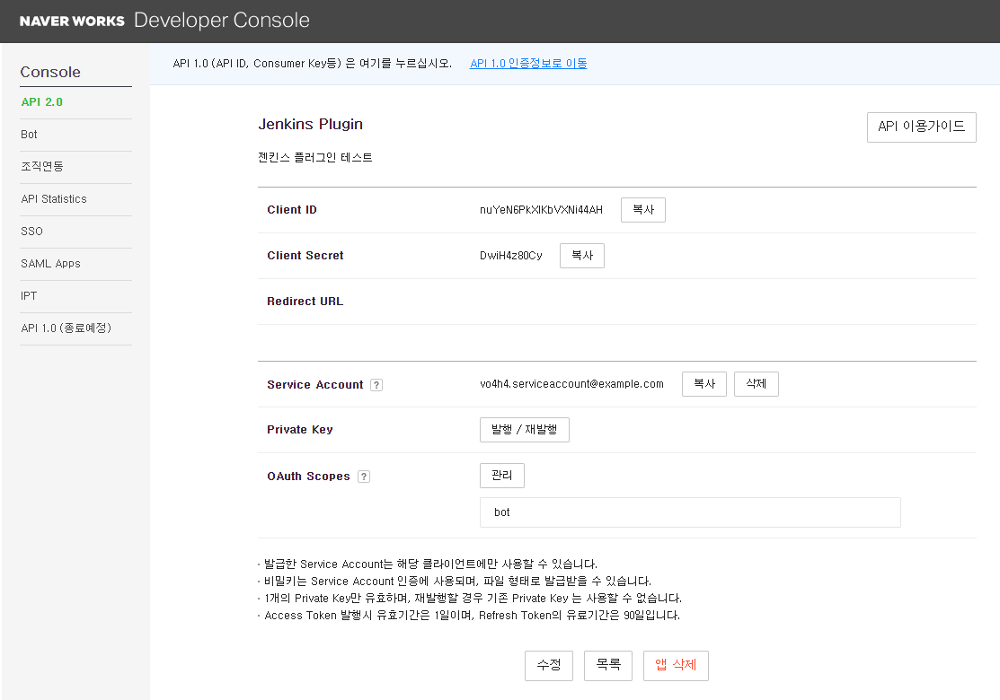
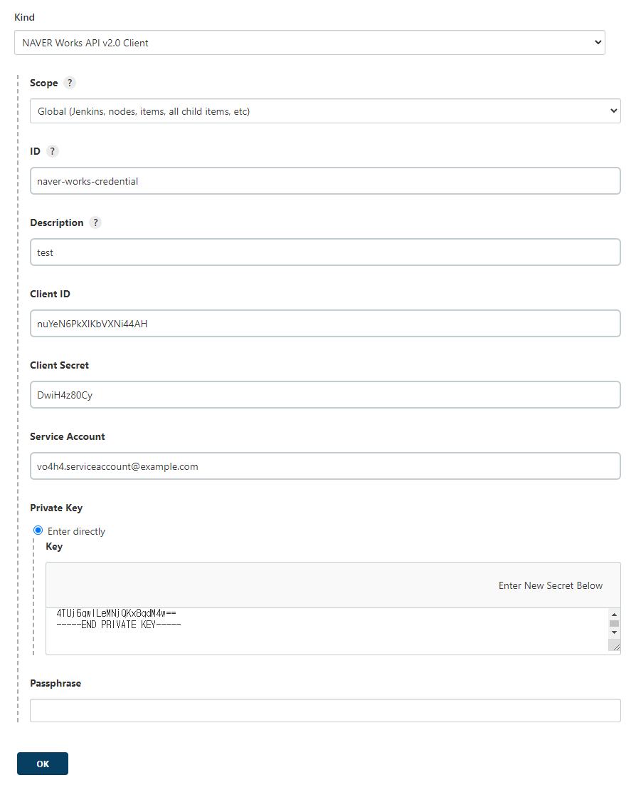
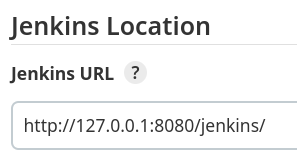
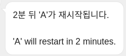
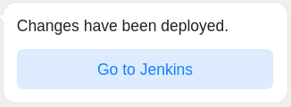
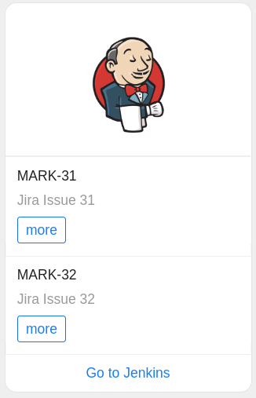
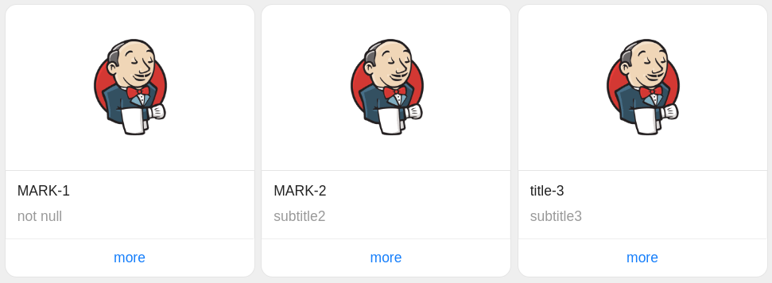

# naver-works-plugin

## Prerequisite

- Java 1.8+

## Test running

````shell
./mvnw clean hpi:run
# Jenkins is fully up and running
````

- Access to http://localhost:8080/jenkins/

## Build

```shell
./mvnw clean install
# target/naver-works.hpi
```

### Upload

> Manage Jenkins > Manage Plugins > Advanced > Deploy Plugin


## Add Credentials

[NAVER Works Developer Console](https://developers.worksmobile.com/kr/console/openapi/v2/app/list/view)에서
앱 정보를 추가하고, Jenkins Credential을 추가한다.





## Pipeline

```groovy
// Jenkinsfile.groovy
stage('Notification') {
    List issues = [
            [link: "https://jira.markruler.com/browse/MARK-31", title: "MARK-31", subtitle: "Jira Issue 31"],
            [link: "https://jira.markruler.com/browse/MARK-32", title: "MARK-32", subtitle: "Jira Issue 32"]
    ]

    naver(
            // required parameters
            credentialId: 'naver-works-credential',
            botId: env.NAVER_WORKS_BOT_ID,
            channelId: env.NAVER_WORKS_CHANNEL_ID,
            messageType: 'list_template',
            // optional parameters
            backgroundImageUrl: env.NAVER_WORKS_BG_URL,
            contentActionLabel: 'Go to Jenkins',
            contentActionLink: env.BUILD_URL,
            messages: issues,
            notification: """${minute}분 뒤 'A'가 재시작됩니다.
                          |
                          |'A' will restart in ${minute} minutes.
                          |""".stripMargin()
    )
}
```

`Manage Jenkins > Configure System > Jenkins Location > Jenkins URL`
구성은 별도로 설정하지 않았다면 기본적으로 `localhost`로 설정된다.
그럼 `BUILD_URL` 환경 변수는 생성되지 않는다.
로그를 확인해보면 `unconfigured-jenkins-location`과 같은 메시지를 확인할 수 있다.
`Jenkins URL`에 젠킨스 서비스 도메인을 입력하거나,
로컬 환경에서 테스트할 경우 `http://127.0.0.1:8080/jenkins/` 와 같이 Loopback 주소를 입력한다.



## Message Templates

### Text

```groovy
naver(
        // required parameters
        credentialId: 'naver-works-credential',
        botId: env.NAVER_WORKS_BOT_ID,
        channelId: env.NAVER_WORKS_CHANNEL_ID,
        messageType: 'text',
        // optional parameters
        notification: """${minute}분 뒤 'A'가 재시작됩니다.
                      |
                      |'A' will restart in ${minute} minutes.
                      |""".stripMargin()
)
```



### Link

```groovy
naver(
        // required parameters
        credentialId: 'naver-works-credential',
        botId: env.NAVER_WORKS_BOT_ID,
        channelId: env.NAVER_WORKS_CHANNEL_ID,
        messageType: 'link',
        // optional parameters
        backgroundImageUrl: env.NAVER_WORKS_BG_URL,
        contentActionLabel: 'Go to Jenkins',
        contentActionLink: env.BUILD_URL,
        notification: 'Changes have been deployed.'
)
```



### List Template

```groovy
List issues = [
        [link: "https://jira.markruler.com/browse/MARK-31", title: "MARK-31", subtitle: "Jira Issue 31"],
        [link: "https://jira.markruler.com/browse/MARK-32", title: "MARK-32", subtitle: "Jira Issue 32"]
]

naver(
        // required parameters
        credentialId: 'naver-works-credential',
        botId: env.NAVER_WORKS_BOT_ID,
        channelId: env.NAVER_WORKS_CHANNEL_ID,
        messageType: 'list_template',
        // optional parameters
        backgroundImageUrl: env.NAVER_WORKS_BG_URL,
        contentActionLabel: 'Go to Jenkins',
        contentActionLink: env.BUILD_URL,
        messages: issues
)
```



### Carousel

```groovy
List issues = [
        [link: "https://jira.markruler.com/browse/MARK-1", title: "MARK-1", subtitle: "not null"],
        [link: "https://jira.markruler.com/browse/MARK-2", title: "MARK-2", subtitle: "subtitle2"],
        [link: "https://www.jenkins.io/", title: "title-3", subtitle: "subtitle3"]
]

naver(
        // required parameters
        credentialId: 'naver-works-credential',
        botId: env.NAVER_WORKS_BOT_ID,
        channelId: env.NAVER_WORKS_CHANNEL_ID,
        messageType: 'carousel',
        // optional parameters
        backgroundImageUrl: env.NAVER_WORKS_BG_URL,
        contentActionLabel: 'Go to Jenkins',
        contentActionLink: env.BUILD_URL,
        messages: issues
)
```


