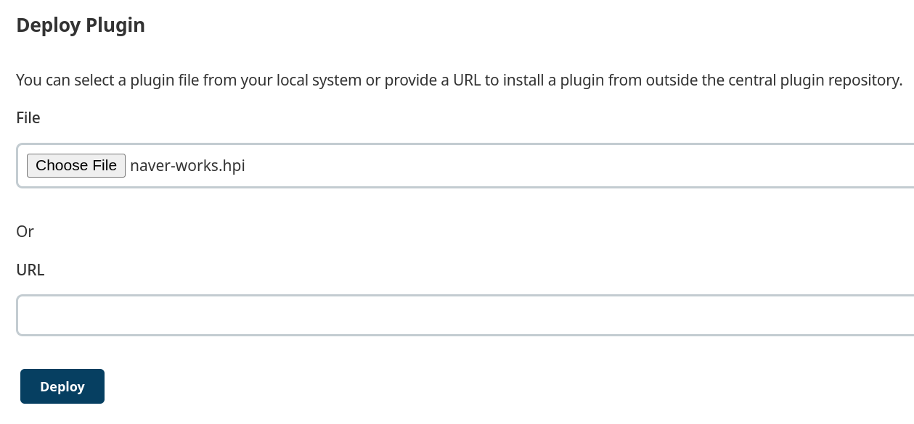

# naver-works-plugin

## Prerequisite

- Java 1.8
- Maven 3.8.3

## Test running

````shell
./mvnw clean hpi:run
# Jenkins is fully up and running
````

- Access to http://localhost:8080/jenkins/

## Build

```shell
./mvnw clean install
# target/naver-works.hpi
```

## Upload

> Manage Jenkins > Manage Plugins > Advanced > Deploy Plugin


